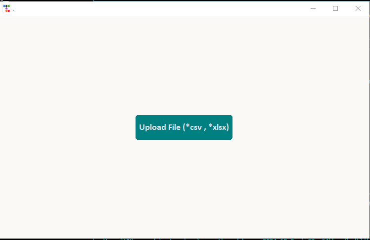
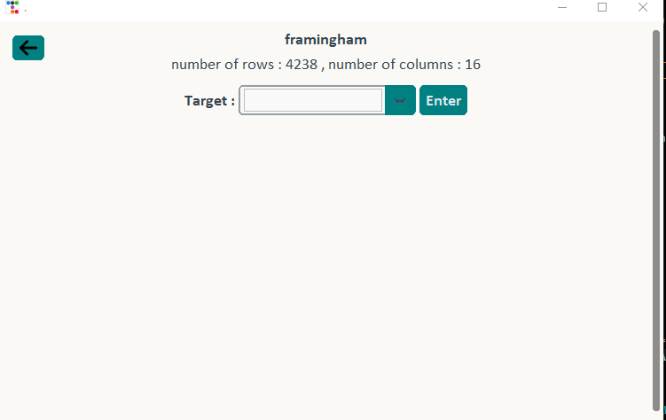
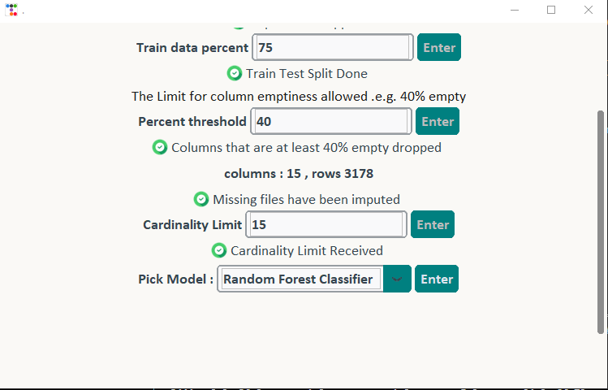
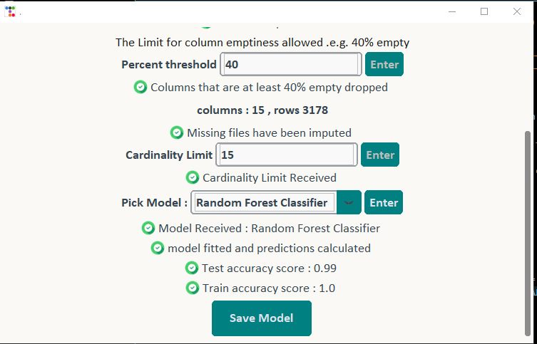

# No-Code Machine Learning App

## Table of Contents
- [Introduction](#introduction)
- [Features](#features)
- [Requirements](#requirements)
- [Installation](#installation)
- [Usage](#usage)
- [Visual Guide](#visual-guide)
- [How It Works](#how-it-works)
- [Customization](#customization)
- [Troubleshooting](#troubleshooting)
- [Contributing](#contributing)

## Introduction

Welcome to the **No-Code Machine Learning App**! This project is a user-friendly application built using Python and Tkinter, designed to make machine learning accessible to **non-programmers** and **data enthusiasts**. With an intuitive interface, you can perform complex machine learning tasks without writing a single line of code.

## Features

- User-friendly graphical interface
- Data import and preprocessing
- Model selection and training
- Export of trained models

## Requirements

- Python 3.7+
- Tkinter
- customtkinter
- ttkbootstrap
- NumPy
- Pandas
- Scikit-learn

## Installation

1. Clone the repository:
   ```
   git clone https://github.com/Nife245/No-Code-Machine-Learning-App-using-Tkinter.git
   ```

2. Navigate to the project directory:
   ```
   cd ML-No COde
   ```

3. **Install the required packages:**
   ```
   pip install -r requirements.txt
   ```

## Usage

1. **Run the application:**
   ```
   python main.py
   ```

2. Use the GUI to:
   - __Import your data__
   - __Select features and target variables__
   - __Choose a machine learning algorithm__
   - __Train and evaluate the model__

### Data Import



To import your data, click on the "Upload File" button and select your CSV or Excel file.

### Model Training

Choose from our selection of machine learning algorithms:

- Linear Regression
- Logistic Regression 
- Random Forest Regression
- Random Forest Classification
- Decision Tree Regression
- Decision Tree Classification 
- Support Vector Regression
- Support Vector Classification

3. After saving the model:
   - Navigate to production.py
   - edit the folder object to the folder path that contains the saved model
   - make use of the preprocess function to generate predictions
   - Note that the preprocess function receives the file to be processed and the file should be a dataframe
     
## Visual Guide

### Application Interface


Our intuitive main interface guides you through the machine learning process step by step.

### Model Selection


Choose from a variety of pre-configured machine learning algorithms.

## How It Works

1. **Data Import**: Users can load CSV and Excel files through the GUI.
2. **Preprocessing**: The app handles basic preprocessing tasks automatically.
3. **Model Selection**: Users can choose from pre-configured machine learning algorithms.
4. **Training**: The selected model is trained on the provided data.
5. **Evaluation**: Results are displayed, including accuracy metrics.
   
7. **Export**: Trained models can be saved for future use.

## Customization

- To add new machine learning algorithms, modify the `MLprocess.py` file.
- To change the GUI layout, update the customtkinter components in `main.py`.

## Troubleshooting

### Common Issues

- **Issue**: Application doesn't start
  **Solution**: Ensure all dependencies are installed and you're using Python 3.7+

- **Issue**: "No module named 'tkinter'"
  **Solution**: Install Tkinter using your system's package manager

## Contributing

**Contributions are welcome!** Please feel free to submit a Pull Request.
